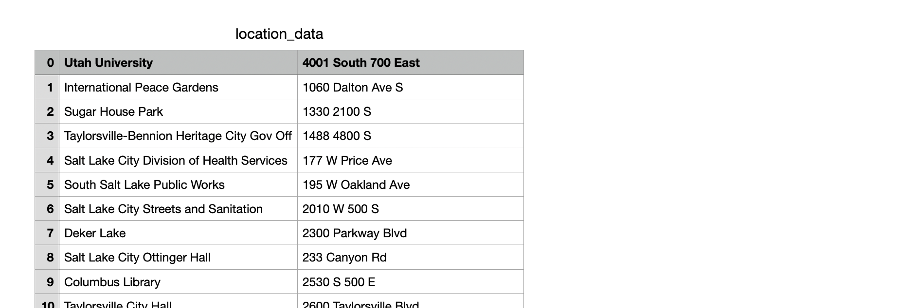
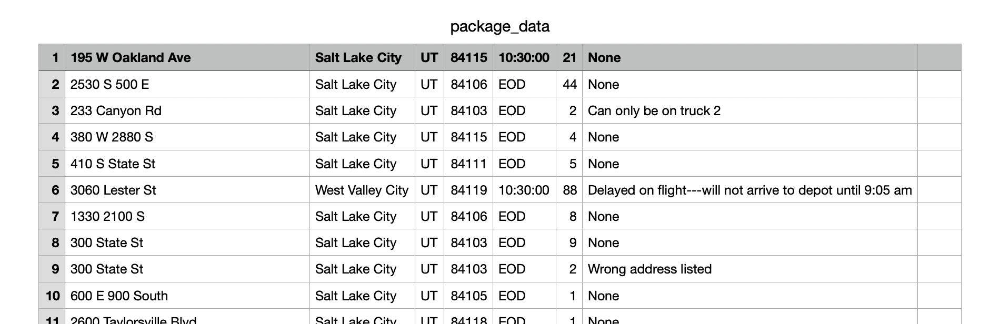
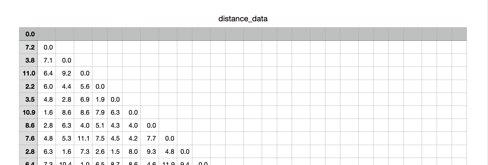
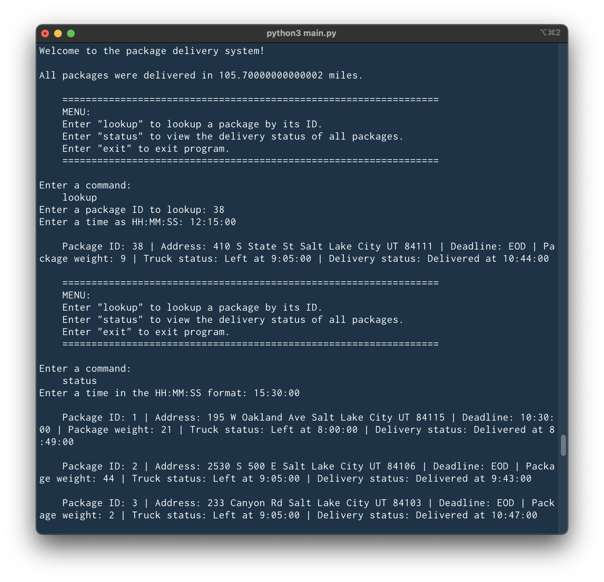

# Package Delivery 

## Description

This is a command line application that finds an optimized route to deliver packages using an implementation of the nearest neighbor algorithm. It also allows you to look up a package by ID to see its delivery status and the time it was delivered. 

A CSV file with package data is read and copied into an iterable Python object. Each package and its corresponding data is inserted in a custom hash table, with the package ID as the key, for O(1) lookup. 

A CSV file with a distance matrix is read and copied into a 2D list. The optimized route algorithm works by searching for the closest location to its current location. The algorithm uses lists to keep track of visited locations and unvisited locations. Once the closest location to the current location is found, it is removed from the unvisited list and added to the visited list. Then the current location is updated. The time complexity is O(N^2) because the outer while loop repeats until every location in the unvisited list is visited, and the inner for loop searches the unvisited list for the closest location to the current location. 

This is the pseudocode for the optimized path algorithm that finds the order of locations to visit that minimizes the total distance traveled. 
```
`Current location` is initialized to the hub (starting point)
`Unvisited locations` is initialized to the list of locations we need to visit
`Visited locations` is initialized to an empty list

WHILE locations to visit remain
  `Shortest distance` is initialized to infinity 
  `Temp location` is initialized to the hub

  # Search for the location closest to the current location
  FOR each unvisited location
    Calculate the distance from current location

    If the calculated distance is less than the shortest distance 
      Update the `shortest distance` to this distance
      Update the `temp location` to this location
      Update the `temp location index` to this index

  # After we find the closest location, update variables
    Add location to the `visited locations` list
    Remove location from the `unvisited locations` list
    Update the `current location` to the discovered closest location
```
Additional constraints for the package delivery system: 
- Three trucks, two drivers
- Trucks travel 18 mph
- Each truck carries a maximum of 16 packages
- Trucks leave hub at 8 am
- Trucks return to hub 
- 40 packages to deliver
- Packages must be delivered by 5 pm
- Packages may have earlier delivery deadlines


## Demo

<!--  -->







## Features

- A console interface and menu to view and look up package information
- Find total distance of an optimized route to deliver every package
- Look up package by package ID and time to see package details, delivery status, and time it was delivered 
- View delivery status of all packages at a given time
- Custom implementation of nearest neighbor algorithm
- Custom implementation of hash table data structure

## Tech Stack
- Python

<!-- ## Lessons Learned -->

## To Do

- In shortest_path_finder(), change for-in loop to enumerate() to get access to the package dictionary's index and eliminate the second for-in loop and eliminate the use of index() method inside manage_queue(). 
- Update to Dijkstra's algorithm
## Setup

Install Python 3. 

Download repository.

```
git clone https://github.com/eunicode/package-delivery-ups.git
```

Move to project folder. 

```
cd package-delivery-ups
```

Optional: If you want to use Black to format your code, consider creating and activating a virtual environment with venv. If you've already created a virtual environment, just activate it. You do not need a virtual environment to install Black, but it is good practice to use virtual environments. 

```
python3 -m venv env # Create virtual environment 
source env/bin/activate # Activate virtual environment 
```

Optional: If you want to use Black, install packages. 

```
pip3 install -r requirements.txt # Or just install Black `pip3 install black`
```

In the terminal, move to `src` folder in project folder.

```
cd src
```

Run code. 

```
python3 main.py
```

If you used a virtual environment, deactivate.

```
deactivate
```
